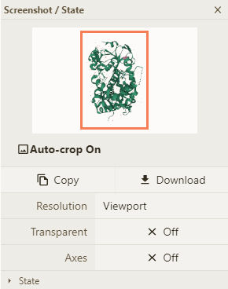
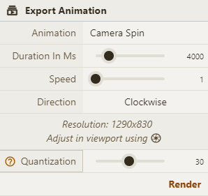

**Images & Movies**

重要功能是图片和动画

#### **Image**

点击 toogle menu 的  可以保存图片

#### **Animation**

点击画布左上角的按钮

基于 [RCSB PDB mol\* documentation](https://www.rcsb.org/3d-view/molstar/help/getting-started)
