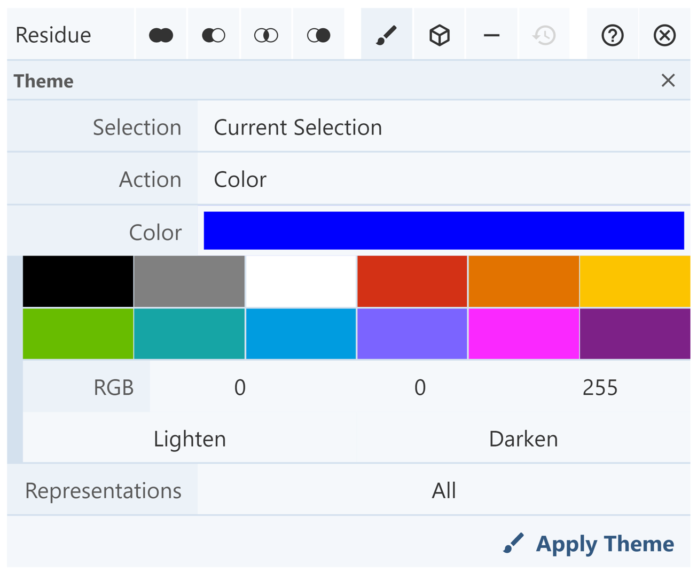
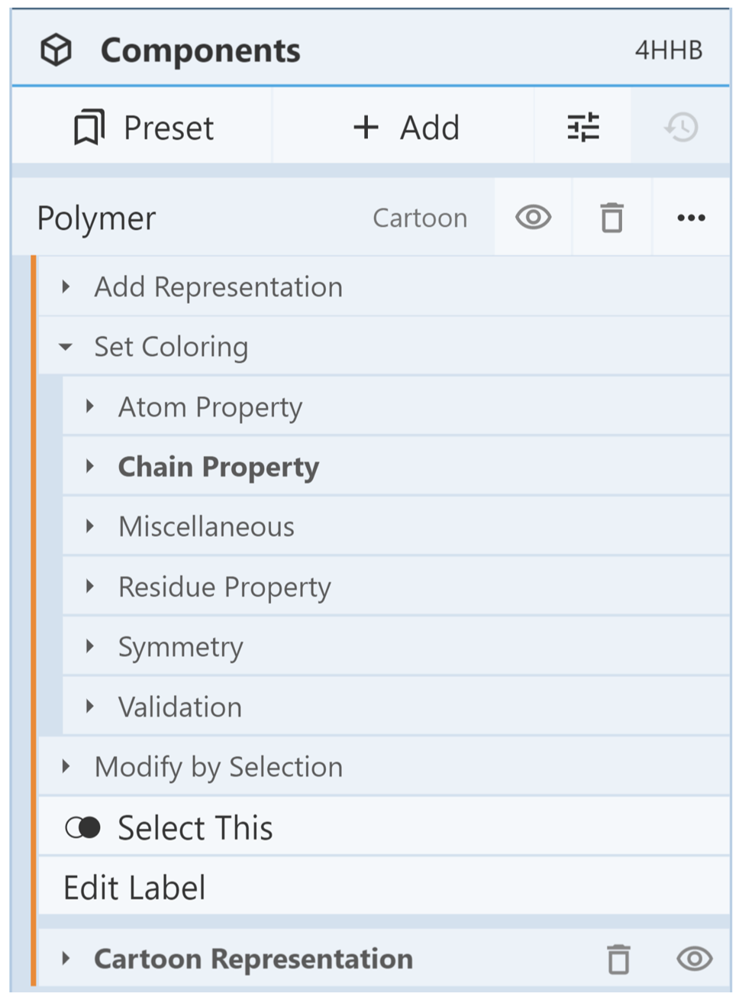
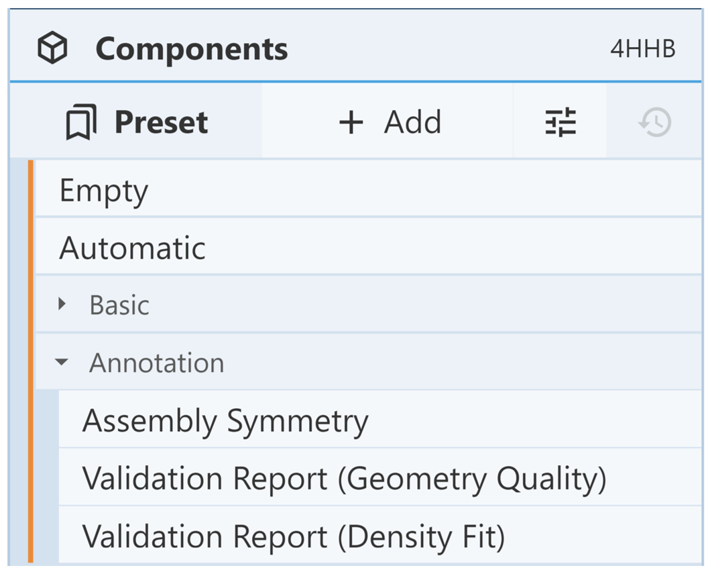
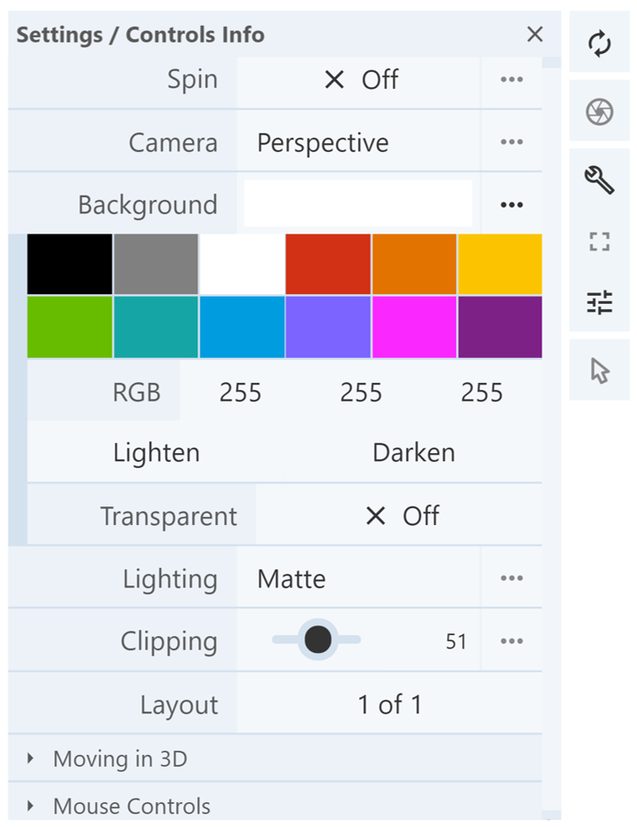
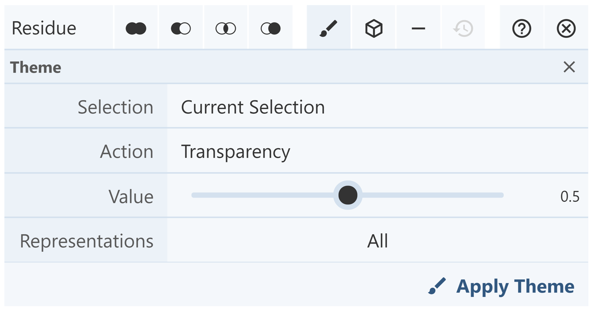
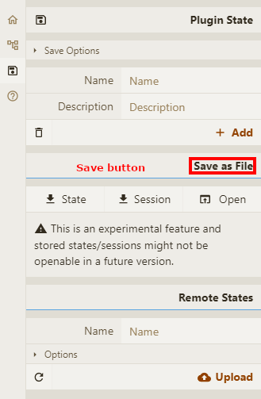

**常见操作**

#### **颜色**

三种方法

**1. Color using Selection Mode:** 在选择模式下，选中节点，选择颜色，点击应用主题

> 说是可以重置颜色，好像没看到怎么操作

**2. Color using the Components Panel:** 当试图根据结构属性应用颜色时，这种方法是最好的。 为要着色的结构部分创建一个组件。 点击 [Components Panel](managing-the-display.md#components-panel) 中的三个点, 然后点击 Set Coloring。 有几个子菜单允许组件根据其结构属性进行着色. 例如, 可以根据链 ID(从 N-末端到 C-末端的彩虹)、疏水性和二级结构等对其进行着色。(it can be colored based on chain ID (rainbow from N-terminus to C-terminus), hydrophobicity, secondary structure, etc.)

**3. Color based on validation report:** 点击 [Components Panel](managing-the-display.md#components-panel), 然后点击 Preset option，在点击 Annotation 会展示以下三个选项

- **Assembly symmetry:** colors structure based on assembly symmetry cluster membership.
- **Validation report (geometry quality):** colors structure based on geometry quality and shows geometry clashes.
- **Validation report (density fit):** colors structure based on density fit.

如下图点击设置图标可以设置画布背景颜色

#### **Transparency**
在 [Selection Mode](making-selections.md#selection-mode)下，选中节点可以设置透明效果，值越大越透明。

#### **Clip Planes**
Clipping 表示隐藏视角周围无用的节点，有两种方法，

1. shift + 鼠标滚轮.
1. 点击设置图标有 选项 Clipping

[Focusing](maneuvering-in-mol_.md#focus) 聚焦到节点时会自动缩放和改变 Clipping

#### **Session/State saving**

Molstar 可以保存单个会话或状态

点击 state 保存为 .molj 文件，点击 session 保存为.molx 文件。  
.molj 文件类似 JSON 仅保存当前视图的整体描述，这个文件不会下载全部模型，当打开这个文件的时候，会从远程下载模型数据，这个需要网络支持。
.molx 会存储模型的二进制文件，不需要网络也可以运行

> In Plugin State you can save the actual state or session of the view as a .molj or .molx files State only saves an overall description of current view in JSON-like .molj file, but the input data are not downloaded and only linked from their original source. This option does not work for local input data. Saving a session stores not only the description, but also input data in binary .molx file. Name and description can be added to the save.

Sessions/states can be opened either from local file or from remote location (e.g. stored on server)

Based on the [RCSB PDB mol\* documentation](https://www.rcsb.org/3d-view/molstar/help/getting-started) thanks to the generosity of RCSB PDB and Dr. Shuchismita Dutta.
