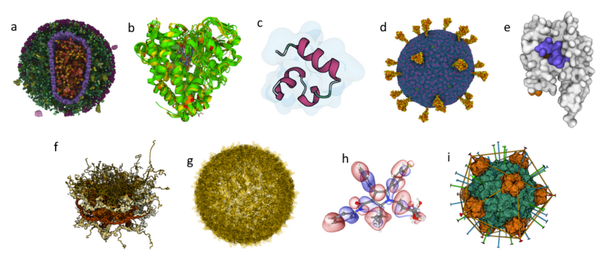

**Examples**

![Mol* 示例]  
很多都是专业方向的例子

在(<https://molstar.org>)中列了以下几个 Mol\*网页示例 :

A. [Enveloped HIV capsid in a blood serum](https://molstar.org/viewer/?snapshot-url=https%3A%2F%2Fmolstar.org%2Fdemos%2Fstates%2Fhiv-simple-cut.molx&snapshot-url-type=molx): 源自 CellPack，包含超过 1300 万个原子。

B. [Superimposition of cytochromes P450](https://molstar.org/viewer/?snapshot-url=https%3A%2F%2Fmolstar.org%2Fdemos%2Fstates%2Fcytochromes.molx&snapshot-url-type=molx): 基于 wwPDB 验证报告，根据结构质量注释对叠加结构进行着色。

C. [Villin un/folding simulation](https://molstar.org/viewer/?snapshot-url=https%3A%2F%2Fmolstar.org%2Fdemos%2Fstates%2Fvillin-md.molx&snapshot-url-type=molx): Part of a set of molecular dynamics trajectories for Markov state model analysis along villin headpiece folding and unfolding pathways. ([doi.org/10.6084/m9.figshare.12040257.v1](https://doi.org/10.6084/m9.figshare.12040257.v1) and <https://pubs.acs.org/doi/full/10.1021/acs.jctc.6b00049>)

D. [SARS-CoV-2 Virion](https://molstar.org/viewer/?snapshot-url=https%3A%2F%2Fmolstar.org%2Fdemos%2Fstates%2Fsars-cov-2_virion.molx&snapshot-url-type=molx): Coarse-grained model composed of glycosylated S-proteins, M-proteins, E-proteins, and a lipid bilayer (<https://dx.doi.org/10.1016%2Fj.bpj.2020.10.048>).

E. [GAIN domain tethered agonist exposure simulation](https://molstar.org/viewer/?snapshot-url=https%3A%2F%2Fmolstar.org%2Fdemos%2Fstates%2Fgain-md.molx&snapshot-url-type=molx): 动态效果 Molecular dynamics trajectory ([doi.org/10.1016/j.molcel.2020.12.042](https://doi.org/10.1016/j.molcel.2020.12.042)).

F. [Nuclear pore complex](https://molstar.org/viewer/?snapshot-url=https%3A%2F%2Fmolstar.org%2Fdemos%2Fstates%2Fnpc.molx&snapshot-url-type=molx): hybrid model originating from PDB-DEV and including 238,288 unique residues.

G. [Zika virus assembly including its Cryo-EM density](https://molstar.org/viewer/?snapshot-url=https%3A%2F%2Fmolstar.org%2Fdemos%2Fstates%2Fzikaem.molx&snapshot-url-type=molx): 数据的原始大小约为 1.6 GB

H. [Molecular orbitals and electron density of atorvastatin](https://molstar.org/demos/alpha-orbitals/): 根据提供的基础和特征向量在 GPU 上局部计算的分子轨道和电子密度的可视化。

I. [DNA binding protein assembly](https://molstar.org/viewer/?snapshot-url=https%3A%2F%2Fmolstar.org%2Fdemos%2Fstates%2F1rb8asm.molx&snapshot-url-type=molx): 展示 RCSB PDB 装配对称性注释的蛋白质装配。

Based on the [RCSB PDB mol\* documentation](https://www.rcsb.org/3d-view/molstar/help/getting-started) thanks to the generosity of RCSB PDB and Dr. Shuchismita Dutta.
