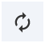
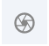

**Getting Started**

#### **General Interface**

用户界面由以下组件构成

**3D Canvas**: 展示蛋白质 3d 模型的区域

**Toggle Menu**: 提供一些快速操作

|                      **Function**                       |                     **Description**                     |              **Icon**               |
| :-----------------------------------------------------: | :-----------------------------------------------------: | :---------------------------------: |
|                     _Reset Camera_                      |             缩放至原始大小，移动到视角中央              |       |
|               _Screenshot/State Snapshot_               |                   将当期画面截图保存                    |        |
|                    _Controls Panel_                     |            扩大 3D Canvas 区域，隐藏其他区域            |      |
|                   _Expanded Viewport_                   | 扩大 3D Canvas 区域至浏览器全屏（_似乎没看见这个选项_） |  |
|                 _Settings/Control Info_                 |              界面显示设置，鼠标控制设置等               |          |
| [_Selection Mode_](making-selections.md#selection-mode) |   在[默认模式](index.md#Default-Mode)和选中模式间切换   |     |

[**Sequence Panel**](navigating-by-sequence.md#sequence-panel): 蛋白质，核酸等顺序，点击能够快速定位到 3d 模型当中

[**Controls Panel**](managing-the-display.md#controls-panel): 以下操作面板

- [Structure](managing-the-display.md#structure-panel)
- [Measurements](managing-the-display.md#measurements-panel)
- [Components](managing-the-display.md#components-panel)
- [Density](managing-the-display.md#density-panel)
- [Assembly Symmetry](managing-the-display.md#assembly-symmetry-panel)
- [Import](managing-the-display.md#import-panel)
- [Session](managing-the-display.md#session-panel)
- [Superposition](managing-the-display.md#superposition-panel)

**Log Panel**: 日志信息

#### **Mouse Controls**

默认情况下 `click` 指的是鼠标左键点击和手势触摸，有以下操作:

- **旋转**: 鼠标左键按住拖动. 或者用 Shift 键 + 鼠标左键拖动
- **移动**: 鼠标右键.或者, 用 Control 键 + 鼠标左键. 在触摸屏上, 用两根手指。
- **缩放**: 鼠标滚轮，在 ipad 上用两根手指滑动，触摸屏用两根手指捏合
- **聚焦**: 鼠标右键点击分子结构
- **裁剪**: 鼠标滚轮 + Shift 来改变裁剪平面

将鼠标移动（不是单击）到 3d 结构上，, 将根据当前选择的[Picking Level](making-selections.md#picking-level)高亮显示它. 此外，在三维画布的右下角，为结构的高亮部分列出了关于 PDB 标识、型号、实例、链标识、残数和链名的信息。

当您使用鼠标与结构交互时，Mol\*包含两种单击行为不同的模式。因此，每种模式都能执行独特的操作。要在两种模式之间切换，请使用出现在切换菜单中的选择模式图标。下面的列表总结了默认模式和选择模式

- **Default Mode**: 左键或右键点击 3d 模型或 Sequence 可以聚焦
- [**Selection Mode**](making-selections.md#selection-mode): 点击选中. What exactly will be selected depends on the value of the [Picking Level](making-selections.md#picking-level). Selected parts of the structure will appear with a bright green tint in the 3D canvas and in the [Sequence Panel](navigating-by-sequence.md#sequence-panel). When selecting polymers with the Picking Level set to “residue,” holding the Shift key while clicking will extend the selection along the polymer from the last clicked residue on. Clicking on any point in the 3D canvas that has no atom will clear the selection.

基于 [RCSB PDB mol\* documentation](https://www.rcsb.org/3d-view/molstar/help/getting-started)
