**Making Selections**

#### **Selection Mode**

进行选中是很多操作的第一步.看 [Selections Logic ](maneuvering-in-mol_.md#selections-logic) 了解更多选中逻辑信息
选中模式有下面几种按钮:

> 好像没啥翻译的，自己试过才知道用处

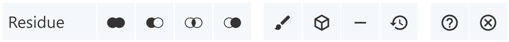

|                    **Function**                     |                                                                                    **Description**                                                                                     |                 **Icon**                  |
| :-------------------------------------------------: | :------------------------------------------------------------------------------------------------------------------------------------------------------------------------------------: | :---------------------------------------: |
| _**Picking Level** for Selecting and Highlighting_  |                                       Controls to what level a selection or highlight interaction is applied (i.e., atom, residue, chain, etc.)                                        | 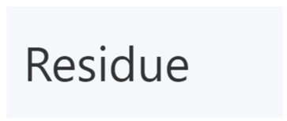 |
|                _Add/Union Selection_                |                                                       The new selection will be the union of the current and the other selection                                                       | 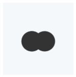  |
|             _Remove/Subtract Selection_             |                                           The new selection will be the current selection with parts that are in the other selection removed                                           | 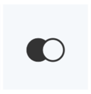  |
|                _Intersect Selection_                |                                              The new selection will be the intersection of the current selection and the other selection                                               | 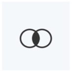  |
|                   _Set Selection_                   |                                                                     The new selection will be the other selection                                                                      | 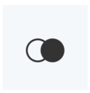  |
|            _Apply **主题** to Selection_            | Enables changes of [color](common-actions.md#color), [transparency](common-actions.md#transparency), and [clipping](common-actions.md#clipping) to be applied to the current selection |   |
| _Create Component of Selection with Representation_ |                                         Enables components to be created and its representations to be changed independent of other components                                         | 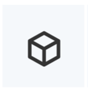  |
|   _Remove/Subtract Selection from All Components_   |                                                          Removes the current selection from being displayed in the 3D canvas                                                           | 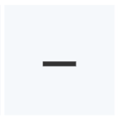  |
|               _Undo Modify Selection_               |                               Allows certain actions (changes of color, hiding of components, etc.) to be reverted while remaining in the selection mode                               |   |
|                   _显示/隐藏帮助_                   |                                                Offers a summary of selection operations, representation operations, and mouse controls                                                 |  |
|              _Turn Selection Mode Off_              |                                                                      Switches from Selection Mode to Default Mode                                                                      | 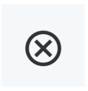 |

#### **Picking Level**

> 选中等级，切换类型之后，鼠标点击选中的类型层级

The Picking Level in Mol\* controls to what level a selection or highlight interaction is applied. Specifically, a selection/interaction can be extended from a single atom to a residue, chain, entity, model, or structure. The default level is residue. For the case of structures with symmetry instances, the interaction can also be extended to include all atom, residue, and chain instances of the clicked atom. In addition, the Picking Level determines the specificity of a selection in the [Sequence Panel](navigating-by-sequence.md#sequence-panel), or the specificity of the focus in [Default Mode](index.md#default-mode). The Picking Level menu can be changed via a menu in the Selection Mode toolbar located at the top of the 3D canvas.

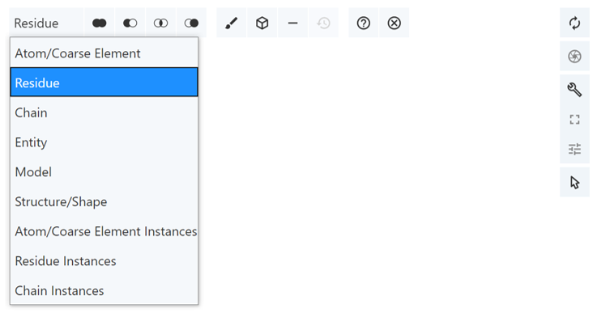

#### **Making Selections**

首页在 Toggle Menu 中启用 [Selection Mode ](making-selections.md#selection-mode)

最简单的方法是鼠标点击模型，或者点击[Sequence Panel](navigating-by-sequence.md#sequence-panel)区域，通过改变[Picking Level](making-selections.md#picking-level)来实现更好的选中效果

第二种方法是通过顶部提供的四种集合模式，如下图

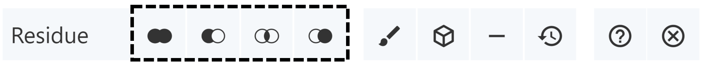

- **Add/Union:** The new selection will be union of the current and the other selection.
- **Subtract/Remove:** The new selection will be the current selection with parts that are in the other selection removed.
- **Intersect:** The new selection will be the intersection of the current selection and the other selection.
- **Set:** The new selection will be the other selection.

其他方法可以通过 [Components Panel](managing-the-display.md#components-panel). 点击 Components 中的 Select This 即可选中

Based on the [RCSB PDB mol\* documentation](https://www.rcsb.org/3d-view/molstar/help/getting-started) thanks to the generosity of RCSB PDB and Dr. Shuchismita Dutta.
